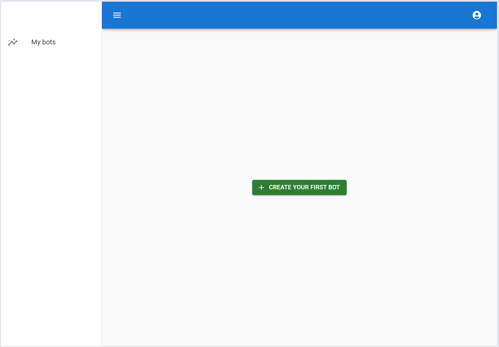
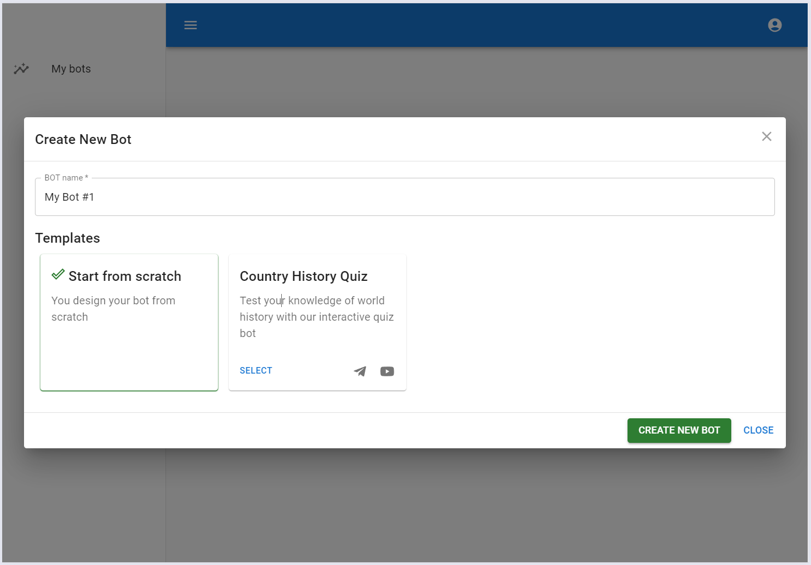
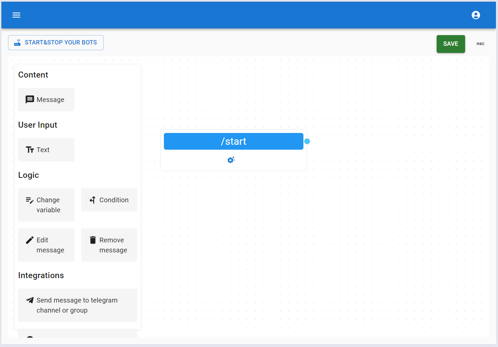
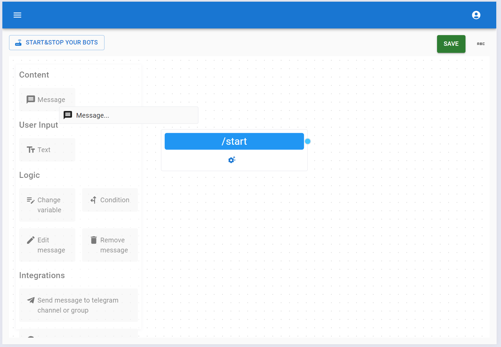
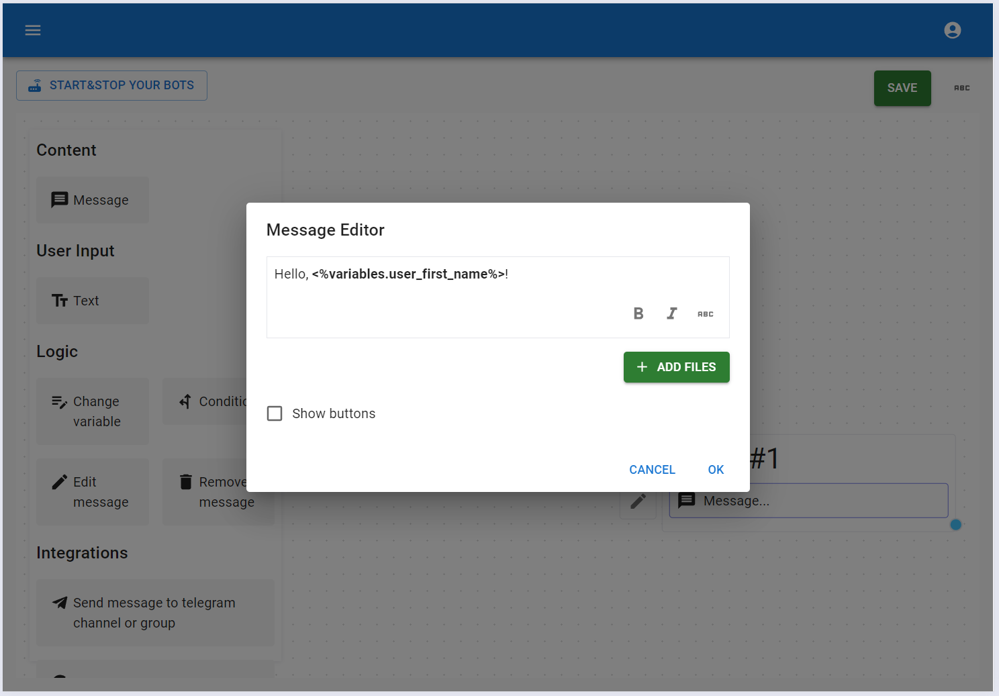
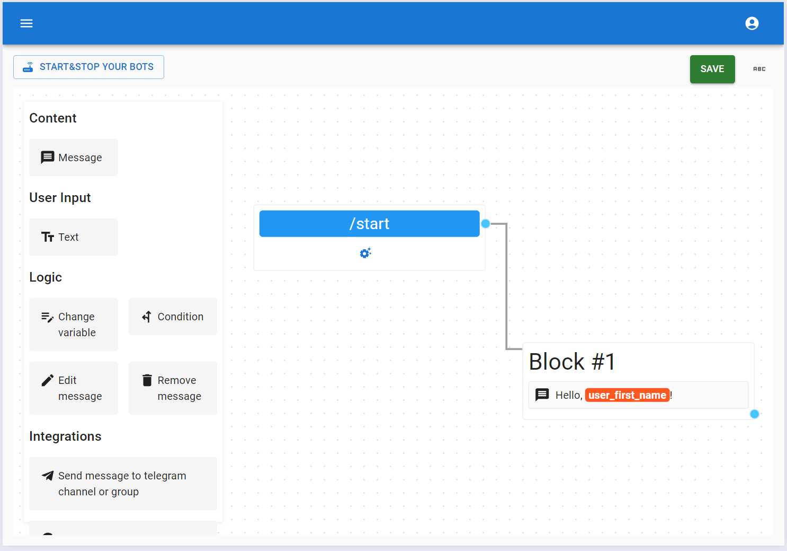
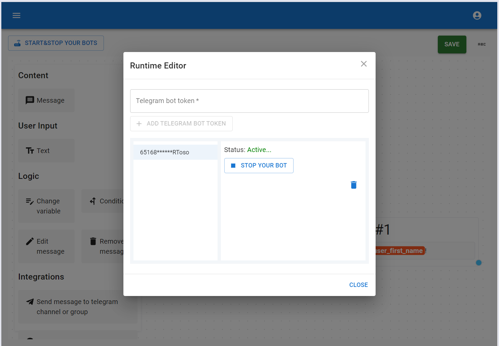
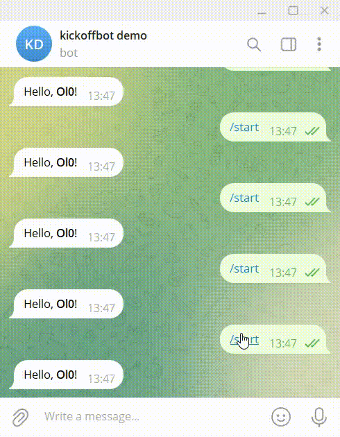

# Create your first Telegram bot

Let's start by creating your first telegram bot on the KickoffBot platform. After you log in, you will see a list of your bots. In your case, this list is empty because you haven’t created any bots yet. Simply click the 'Create Your First Bot' button to get started.

You can create your first bot using a built-in template or from scratch. Let's create one from scratch.

Great! Now you see the default first block where you can set up commands for your Telegram bot. Everything starts with the default command `/start`. When a user interacts with your bot for the first time, they should click the start button, which sends the command `/start`.

Your first bot simply greets the user. To do this, you need to drag the `Message` element from the toolbox to the designer area.

We should configure the `Message` element to use the built-in Telegram variable that contains the user's first name.

Then, connect it to the `/start` command and that we have here.

We need to save your bot configuration. To do this, click the `Save` button in the top-right corner. After that, click `Start & Stop Your Bots` button in the top-left corner to publish your bot.

You should share your bot access token (from https://t.me/BotFather) with the KickoffBot platform and start your bot.

Congratulations! Your first telegram bot is ready!

