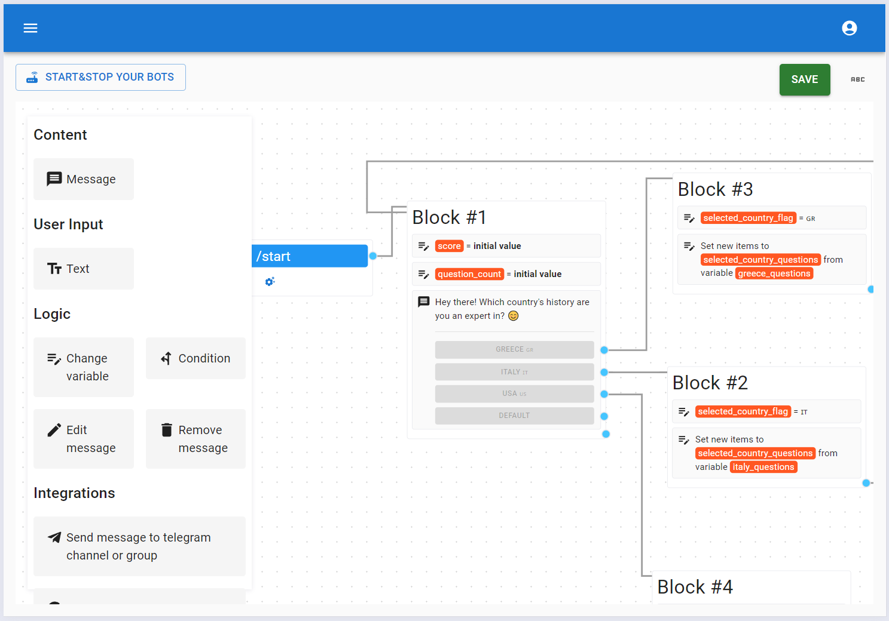

# Designer

The designer is the area where you can design your Telegram bot. It's easy — just drag and drop elements from the toolbox, connect them, and your bot is ready.

What are **elements** and **blocks**? An **element** is a part of the bot’s logic, what the user can see (e.g. [Message](./elements/message-element.md)) or integration with service in process of interaction user with your bot. A **block** is a group of elements used for better elements organization.

