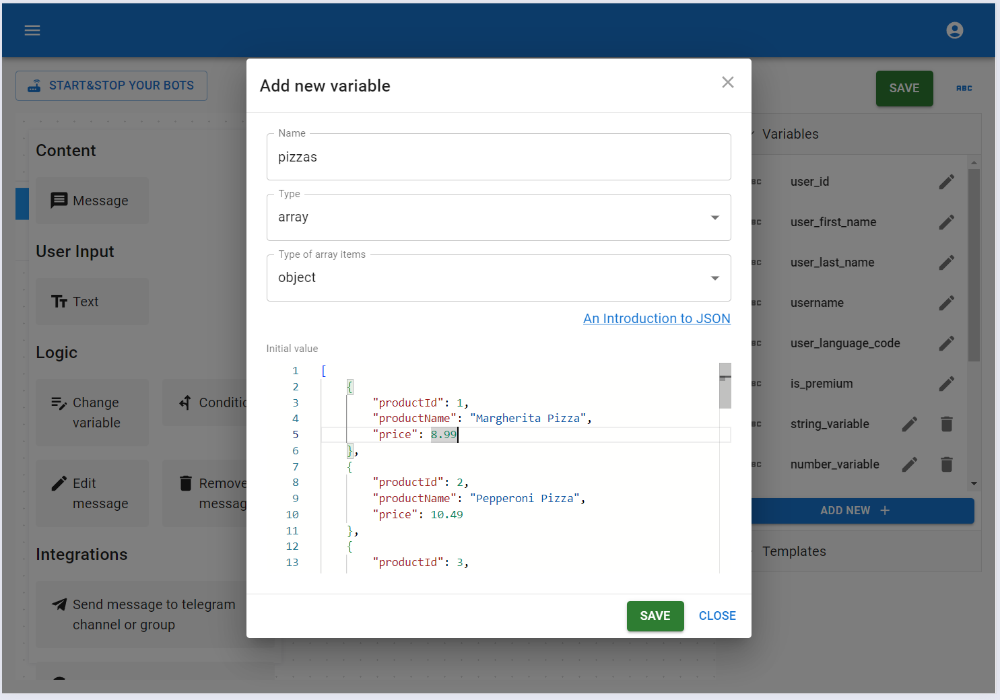

# Change variable

This element lets you change variable values during user interaction with your bot. On this page, we’ll look at how to change different types of variables.

### Change `string` variable

Let’s look at how to change a string variable with an example bot. Depending on the user’s choice, this bot will either set a new value for the variable or reset it to the default. First, let’s create a string variable with a default value.


Next, let’s design our bot. After the `/start` command, we’ll send the user a message showing the current value of our variable and ask them to choose an action: set a new value in Block #1 or reset the variable to its default value in Block #2.


When changing the value of a variable, you can use the values from other variables.


It looks like our bot is ready. Let’s save it and launch it.


### Change `number` variable

Let’s create a simple Telegram bot that adjusts a variable by one based on the user's choice. To start, let’s create a number variable.


Next, we’ll design our bot.


In Block #1, use an element that adds 1. In Block #2, use an element that subtracts 1.


### Change `boolean` variable

Changing a boolean variable is similar to updating number and string variables. You can set it to `True`, `False`, the opposite of its current value, or its default value.


### Change `object` variable

The value for an object variable can come from another object variable or an array of objects. If the source is another object variable, we simply copy its value. If the source is an array, we select one object from the array based on the conditions given in this element and copy that into our variable.

Let’s see how this works in practice when source is other object. We’ll create two object variables with different values.


Let's build our bot. When the `/start` command is sent, the bot will display the values of the first and second objects. When the user presses the button, it will copy the value from the second object to the first and send messages showing the updated values of both objects.


Let's start our bot and check how it works.


Let’s see how this works in practice when source is array of objects. We create an object variable that will get its value from an array of objects. We'll also need another variable to hold the array from which we'll select and copy an object into our object variable.




```js title="Default value - Array variable"
[
    {
        "productId": 1,
        "productName": "Margherita Pizza",
        "price": 8.99
    },
    {
        "productId": 2,
        "productName": "Pepperoni Pizza",
        "price": 10.49
    },
    {
        "productId": 3,
        "productName": "Vegetarian Pizza",
        "price": 11.29
    },
    {
        "productId": 4,
        "productName": "BBQ Chicken Pizza",
        "price": 12.49
    },
    {
        "productId": 5,
        "productName": "Hawaiian Pizza",
        "price": 10.99
    },
    {
        "productId": 6,
        "productName": "Buffalo Chicken Pizza",
        "price": 11.99
    },
    {
        "productId": 7,
        "productName": "Four Cheese Pizza",
        "price": 12.99
    },
    {
        "productId": 8,
        "productName": "Spinach and Feta Pizza",
        "price": 9.49
    },
    {
        "productId": 9,
        "productName": "Sausage Pizza",
        "price": 10.29
    }
]
```

Once our variables are set up, we can start designing our bot. After the `/start` command, we'll display the default object's values. When the user clicks the button, we'll select the first pizza from the array whose name starts with the letter `S`, copy this pizza into a variable, and show the values from that variable.


Now we can save it and see how our simple Telegram bot works.


### Change `array` variable

This element allows us to:

- Add items to an array variable from another array variable, with the option to filter which items to include and which to exclude.

- Add object to an array variable

- Set a new value in an array based on another array

- Update an array with a new value based on object

- Delete elements from an array with the option to filter which ones to keep or remove

