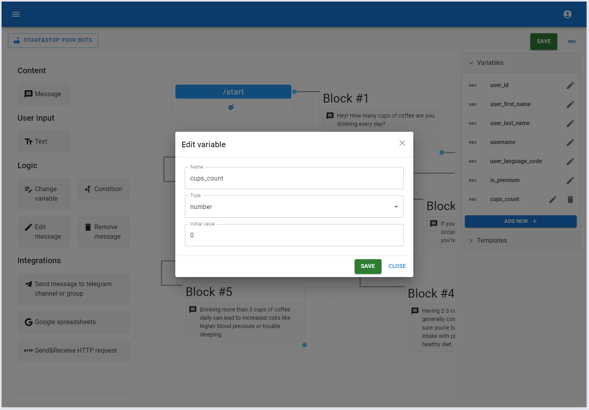
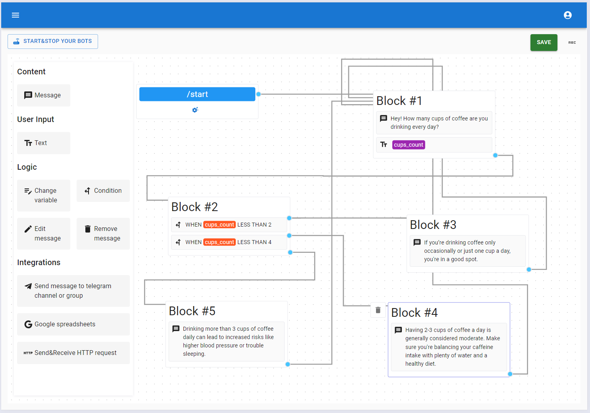
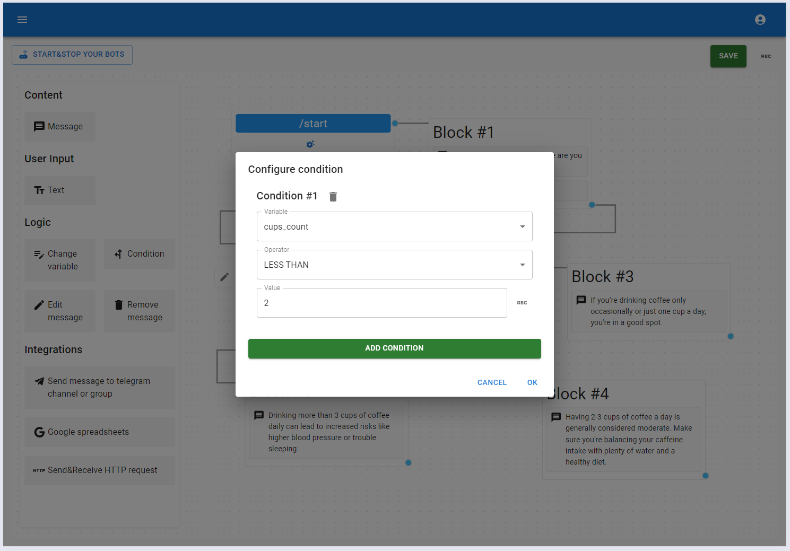
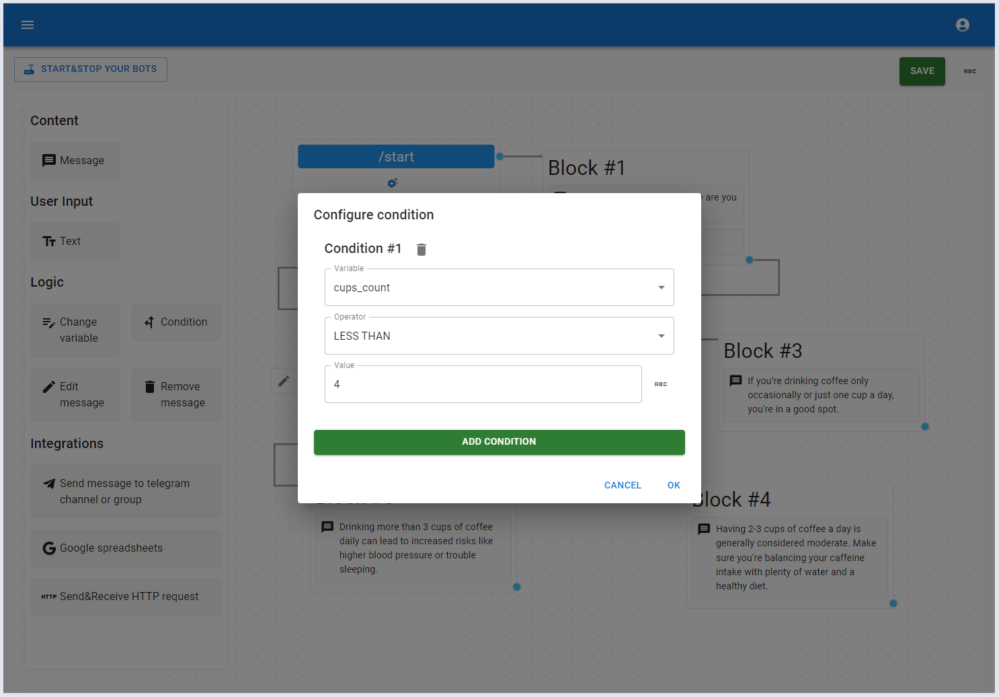
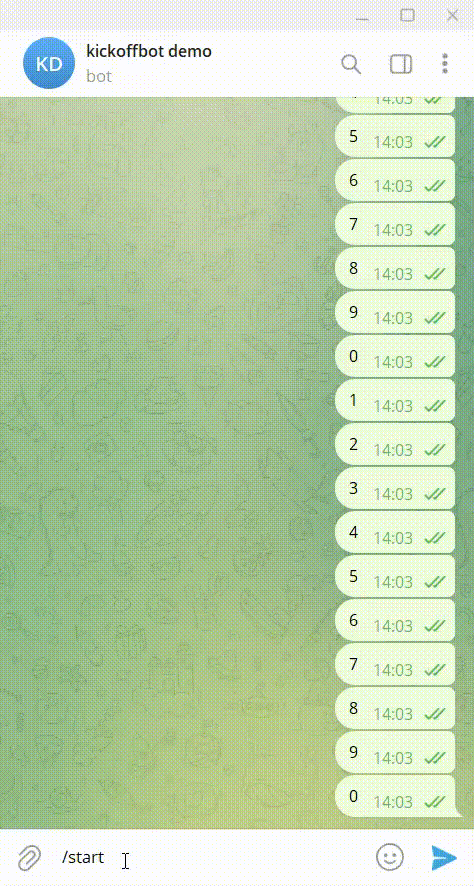

# Condition element

This element guides how your bot behaves based on the values of its variables. It allows you to create a personalized experience for each user. 

For example, our bot will ask how many cups of coffee you drink daily and provide tailored recommendations based on user's answer.

Let's launch our bot and see it in action!

