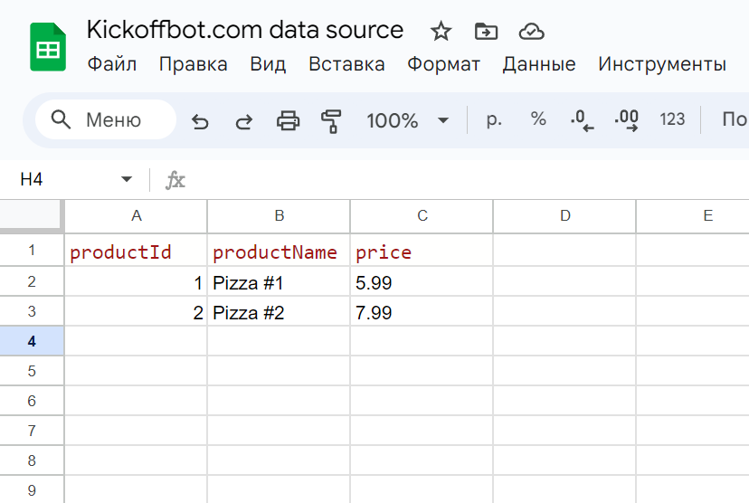
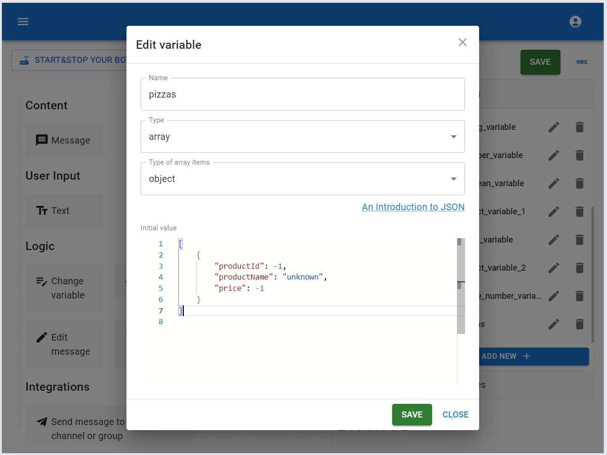
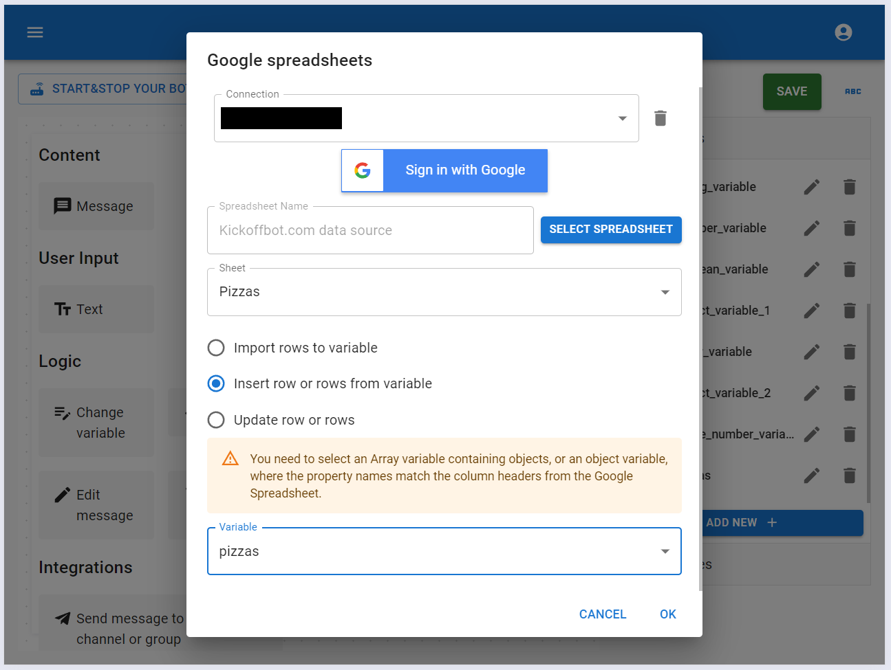
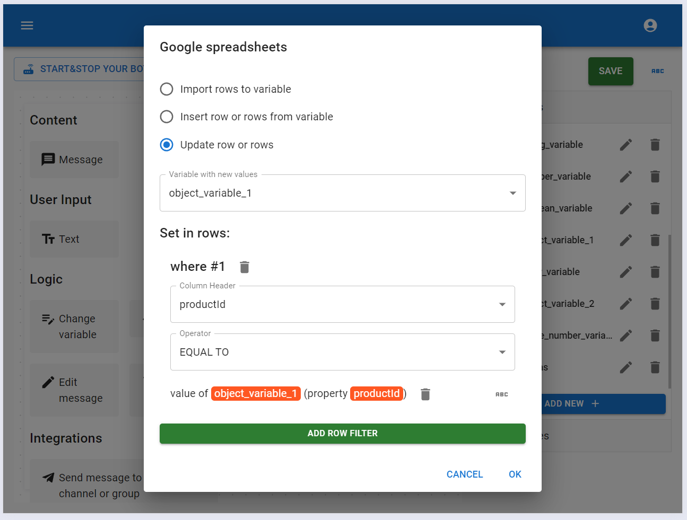

# Google spreadsheets

This element lets you work with Google Sheets. You can import data into variables, add new row or rows, and update existing rows in Google Sheets while user using your bot.

- import rows to variable

You can only import rows from Google Sheets into an array variable where the object properties match the column names in the sheet.

- insert row or rows to table from variable

You can add a single row to a Google Sheet if the data source is an object, or multiple rows if the data source is an array of objects. As with importing, the object or objects properties must match the column names in the Google Sheet.

- update row or rows

In this case, the data source is an object variable. We also need to set criteria to find the row or rows we want to update with values from the variable.