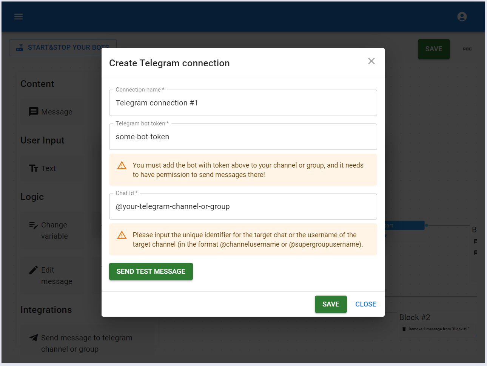
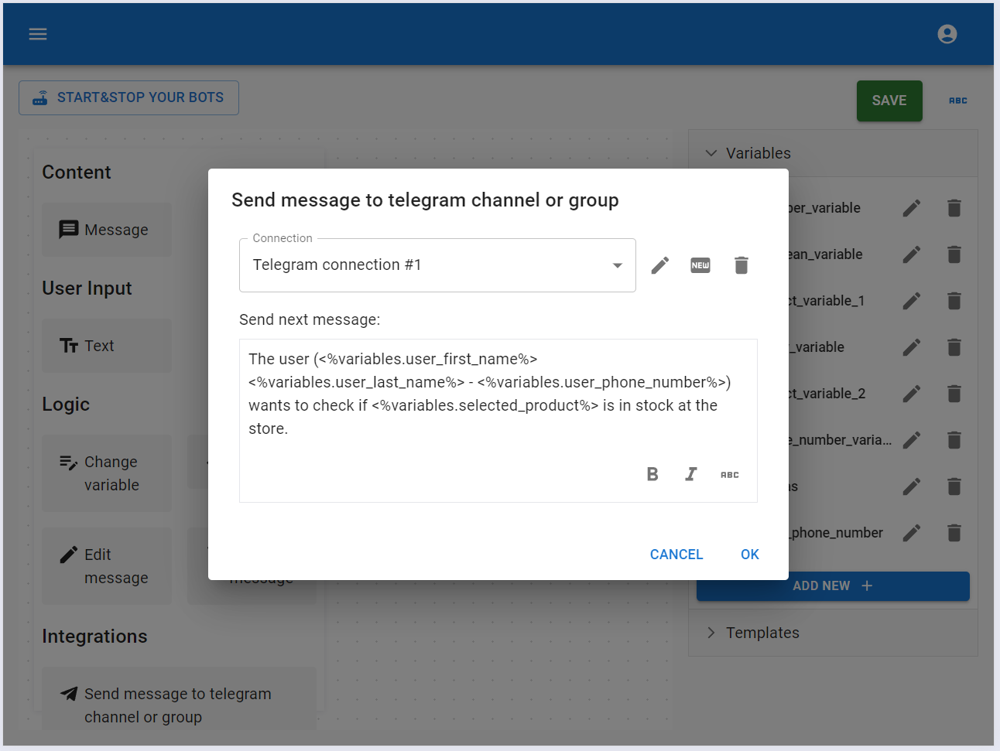
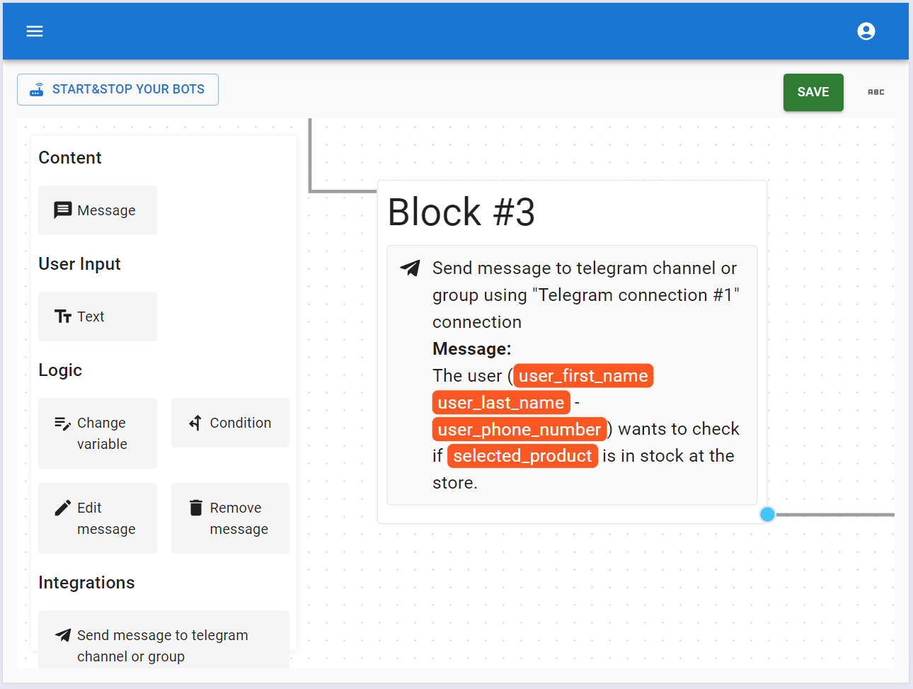

# Send message to telegram channel or group

This element lets you send a message to any channel or group while the user is interacting with your bot. For instance, if a user places an order through your bot, you can automatically send the order details to a Telegram group where a cafe administrator will handle it.

After dragging the element from the toolbox, you need to set it up. The first step is to create a Telegram connection by specifying the group or channel where the message should be posted and entering the Telegram bot token. Make sure to add the bot to that group or channel with permission to send messages.

Next, we set up the message to be sent to the chat or group. In the message, we can use variables that reflect the current status.

