# Message

The `Message` element is the most important element; it helps send text, images, documents, and inline buttons to the bot user. To use it, simply drag and drop it from the toolbox onto the designer area.

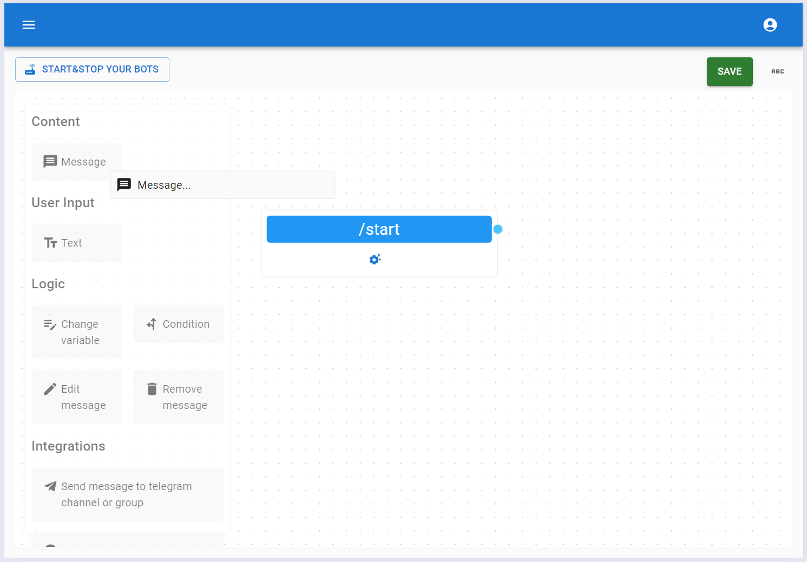

After that, you can edit the `Message` element by clicking the `Edit Element` button.

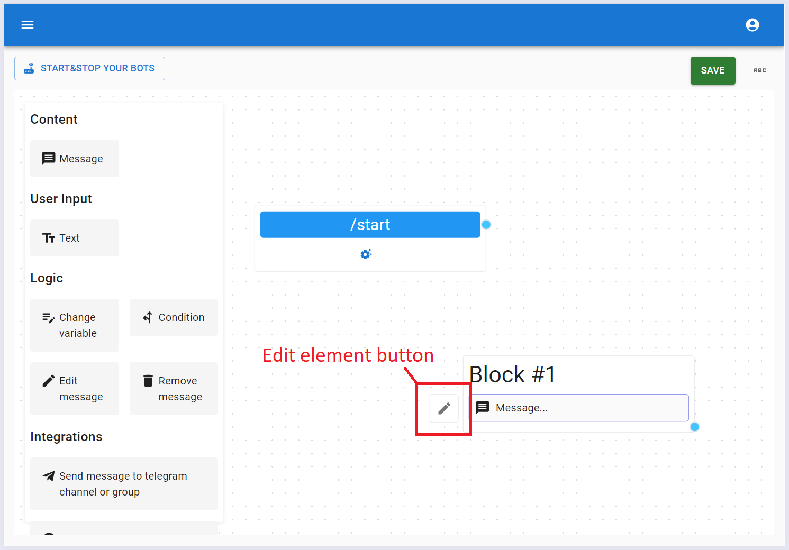

The message editor allows you to edit text, format it, and attach images and documents to the messages that the bot sends to users.

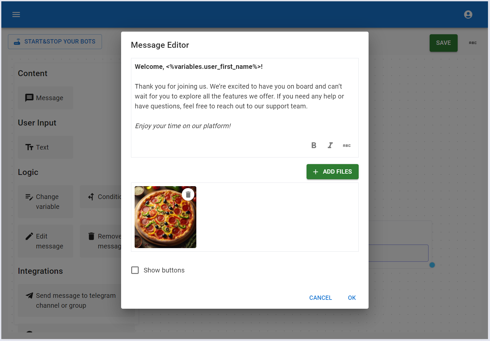

## Inline buttons

It is also possible to add inline buttons to your message. The source of the buttons can be your design in the message or a variable of `Array` type. If you are not familiar with the concept of variables on the KickoffBot platform, [please read this](../variables.md).

### Manually added buttons

Let's now add two inline buttons manually.

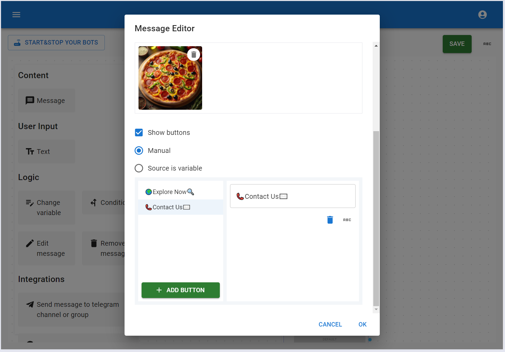

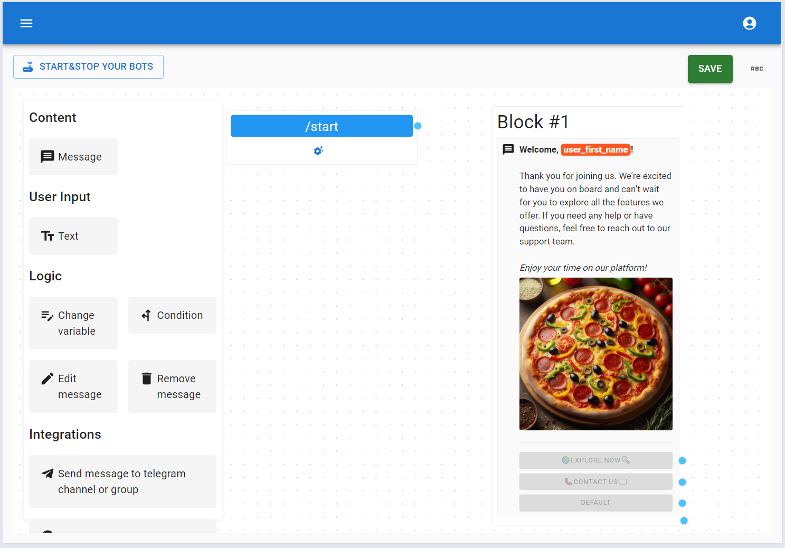

Let's connect our welcome message with the `/start` command, create two additional messages, and link them to the buttons from the welcome message.

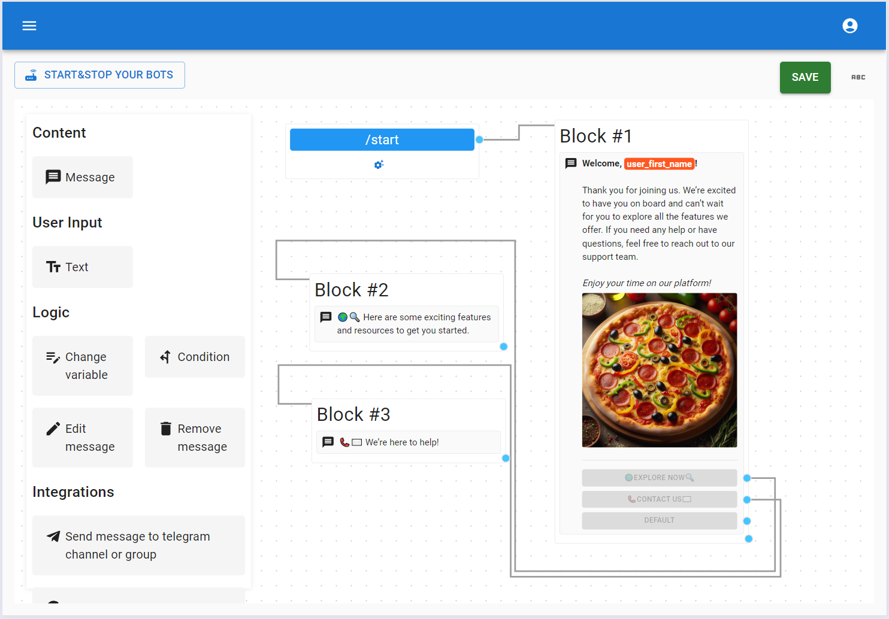

Now the bot is ready, so we can save and deploy it.

### Buttons from variable

Let’s [create a variable](../variables.md#manage-bot-variable) where the default value is an array of objects. This variable will be used to generate the buttons for the current message.

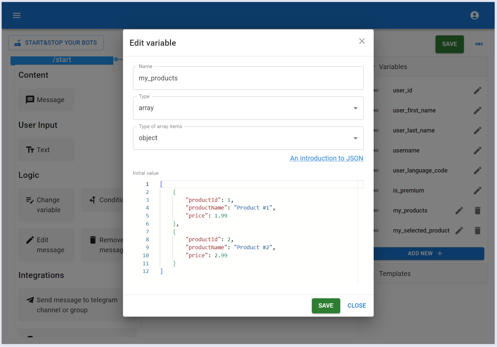

We’ll also need another variable to store the object linked to the button that the user clicks on in your bot.

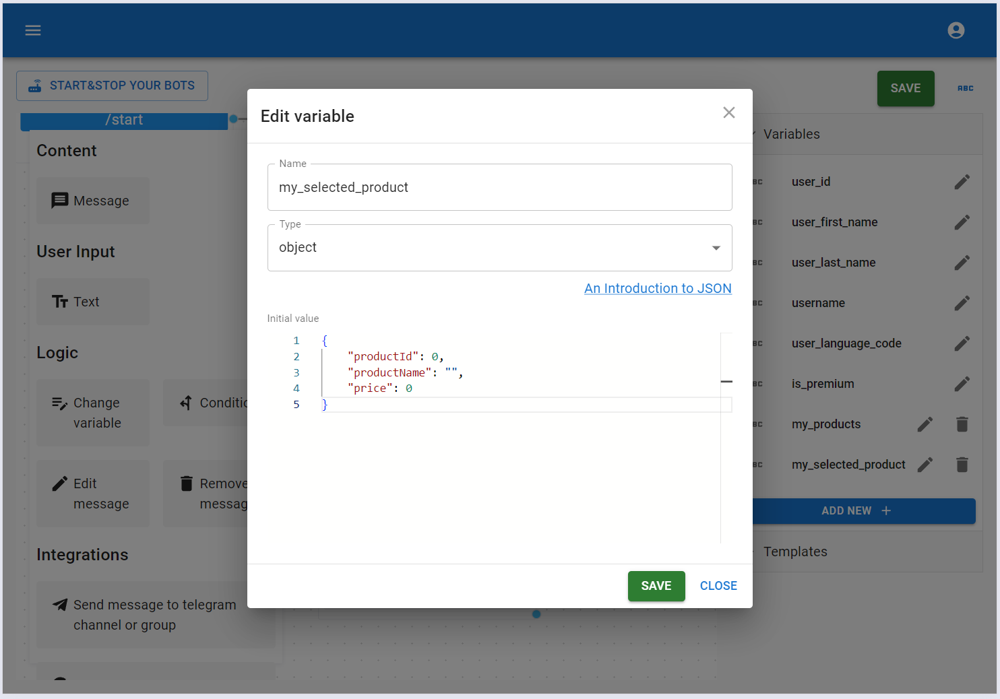

Then, in the Message editor, set the variable that will be data source of the buttons and choose the variable for saving the object associated with the chosen button. Note that you can use properties of the button’s object or static text in the button's label.

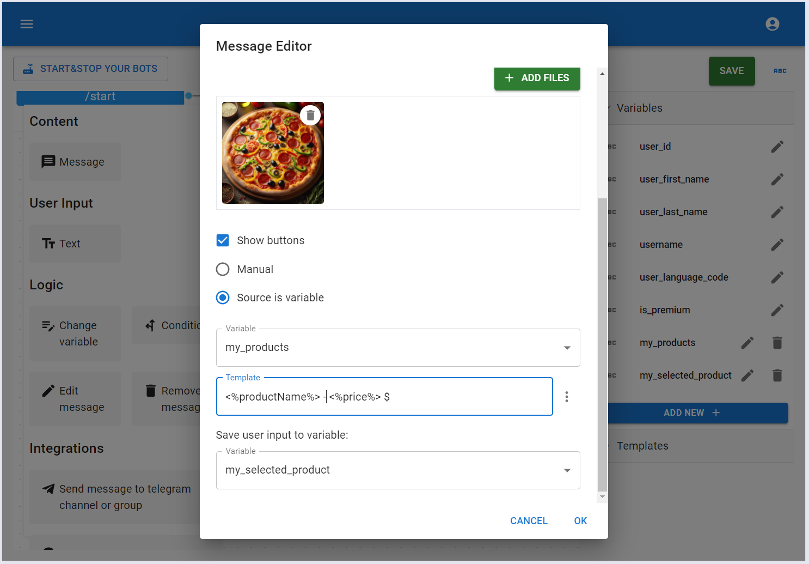
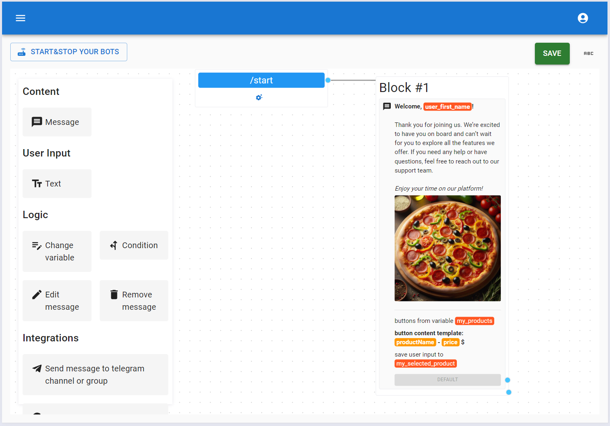

Once the user clicks on a button from the welcome message, we’ll send them a message with details about the selected object.

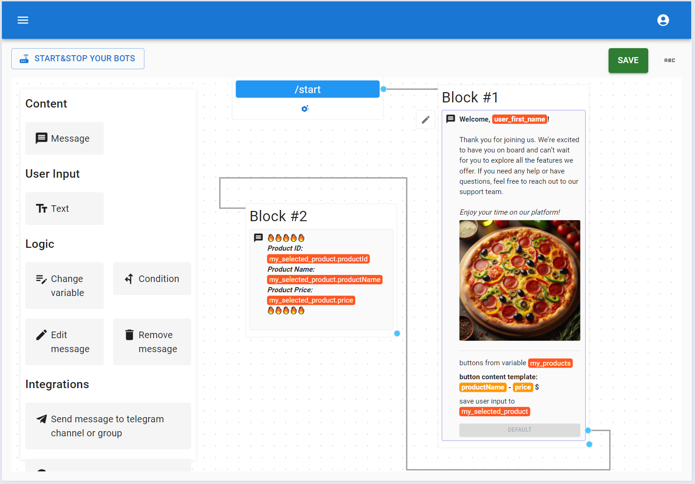

Now, we can save the bot’s configuration and see it in action.

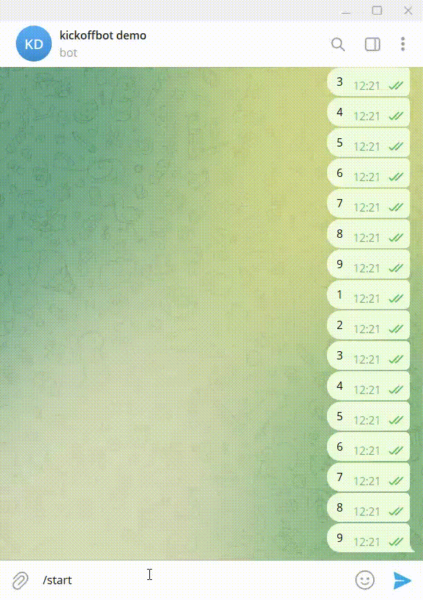
