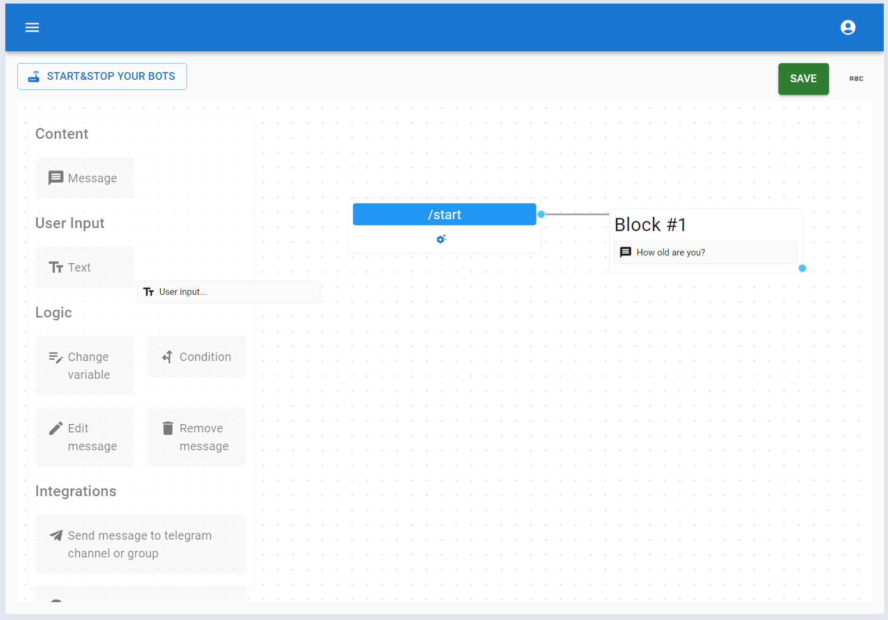
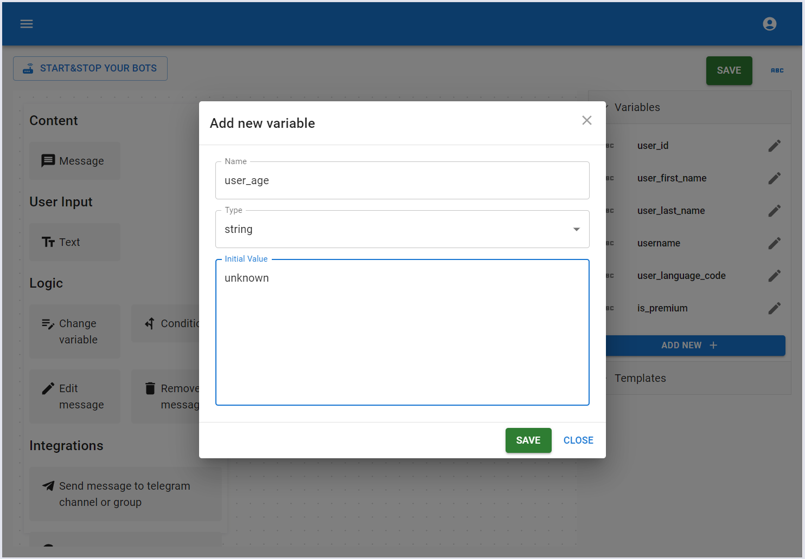
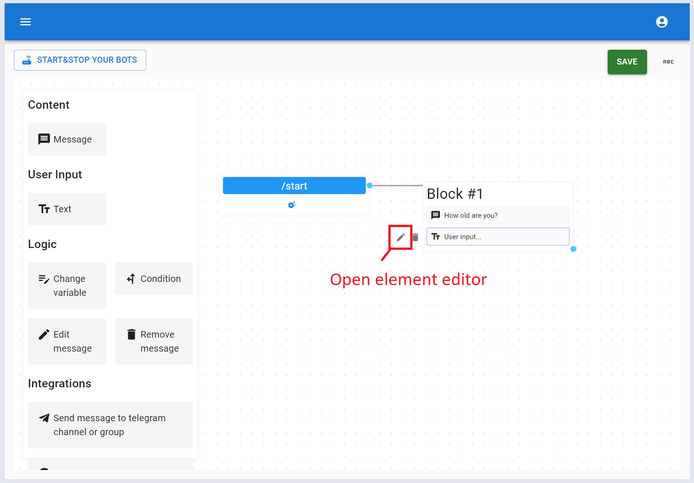
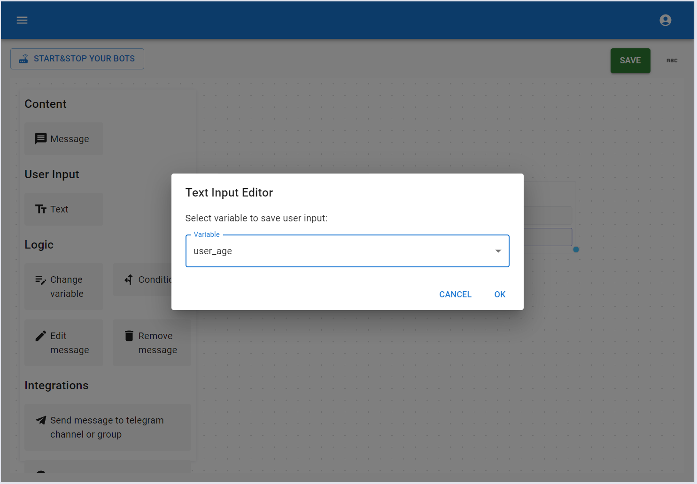
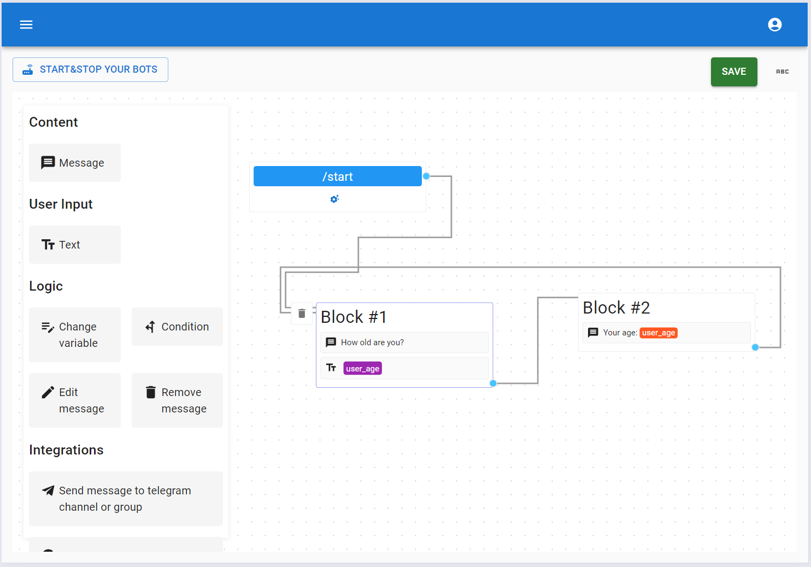
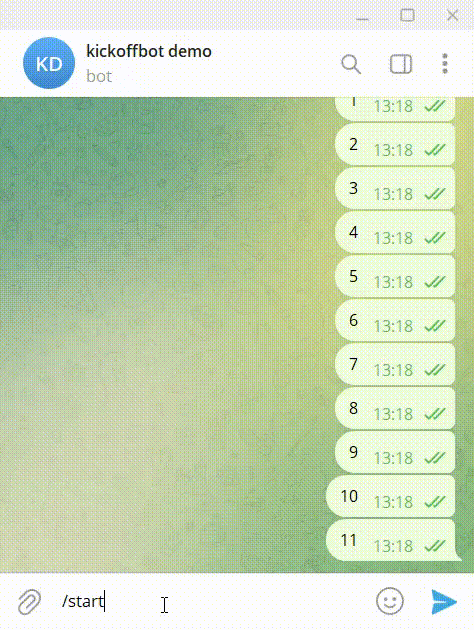

# User Input

This element lets you receive messages that users send to the bot. Let's see how this element works with a simple bot example. The bot asks the user for their age and then uses the [Message](./message-element.md) element to show the user their age.

This element stores the message received from the user in a variable. Let’s [create a variable](../variables.md#manage-bot-variable) to hold the user’s age.

Now, we need to open the element editor.

In the editor, we need to set the variable where the bot will store the user's age.

To complete our simple bot, we'll add a message that displays the user's age and then asks them for their age again.

Now, we can save, run the bot, and see how it works.

