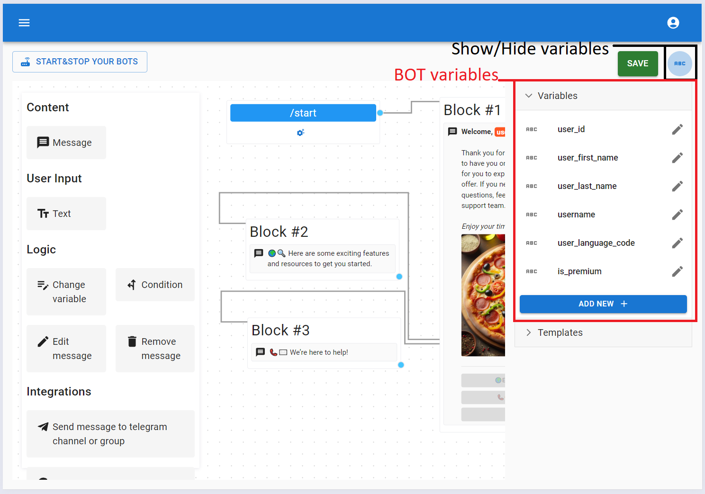
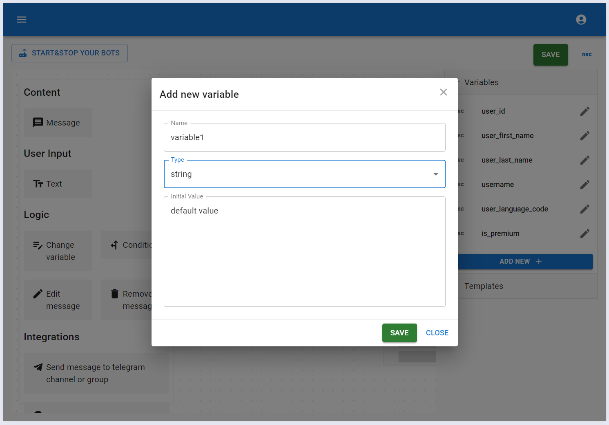
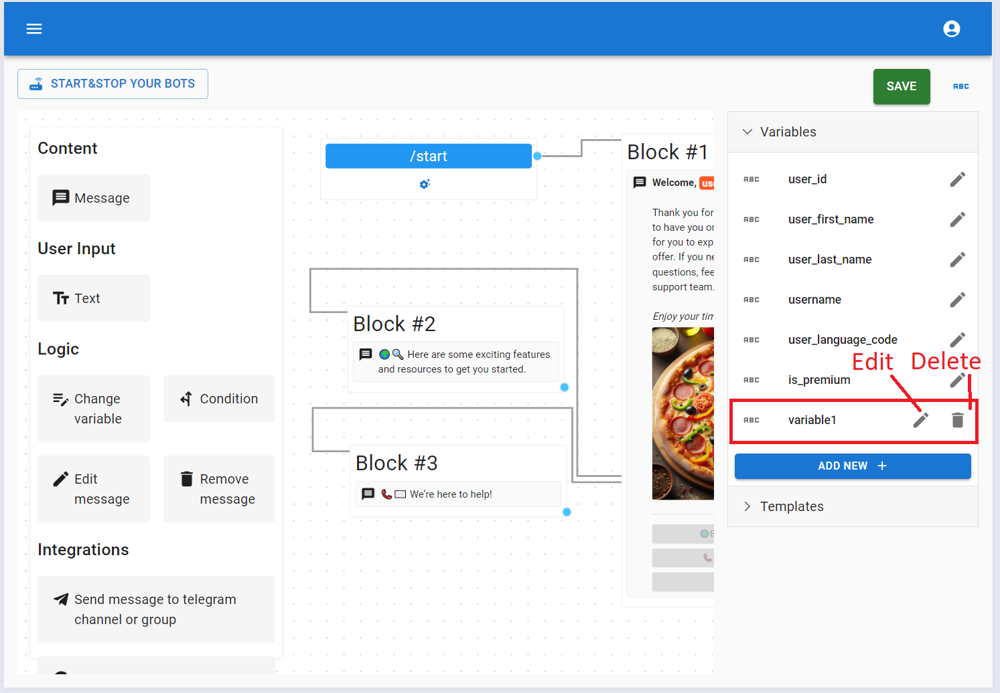

# Variables

## Overview

Variables on KickoffBot are used to store information while users interact with your bot. You can change these variables using elements, display them in messages, and share them with other services. This concept of variables allows you to create a bot of any complexity.

## Variable types

KickoffBot supports different types of variables:

- **String**: This type holds text. For example, "Hello, world!", "How are you?", or "Jay".
- **Number**: This type is used for numbers. Examples include 1, 2, 99, or -6.
- **Boolean**: This type has two values: True or False, similar to Yes or No in everyday life.
- **Object**: This type lets you describe a real-world object using its properties.

Examples of objects:

```js title="Car"
{
    "make": "Toyota",
    "model": "Camry",
    "year": 2024,
    "color": "Blue",
    "price": {
      "currency": "USD",
      "amount": 30000
    }
}
```

```js title="Pizza"
{
    "name": "Margherita",
    "size": "Medium",
    "crust": "Thin",
    "ingredients": [
      "Tomato Sauce",
      "Mozzarella Cheese",
      "Fresh Basil",
    ],
    "isVegetarian": true,
    "isGlutenFree": false,
    "price": {
      "currency": "USD",
      "amount": 12.99
   ,
    "calories": 250,
    "cookingTime": "15 minutes"
}
```

- **Array**: This type is a collection of items of the same kind.

Examples of arrays:

```js title="Array of cars"
[
  {
    "make": "Toyota",
    "model": "Camry",
    "year": 2024,
    "color": "Blue",
    "price": {
      "currency": "USD",
      "amount": 30000
    }
  },
  {
    "make": "Honda",
    "model": "Civic",
    "year": 2023,
    "color": "Red",
    "price": {
      "currency": "USD",
      "amount": 25000
    }
  },
  {
    "make": "Ford",
    "model": "Mustang",
    "year": 2022,
    "color": "Black",
    "price": {
      "currency": "USD",
      "amount": 35000
    }
  }
]
```

```js title="Array of pizzas"
[
  {
    "name": "Margherita",
    "size": "Medium",
    "crust": "Thin",
    "ingredients": [
      "Tomato Sauce",
      "Mozzarella Cheese",
      "Fresh Basil"
    ],
    "isVegetarian": true,
    "isGlutenFree": false,
    "price": {
      "currency": "USD",
      "amount": 12.99
    },
    "calories": 250,
    "cookingTime": "15 minutes"
  },
  {
    "name": "Pepperoni",
    "size": "Large",
    "crust": "Thick",
    "ingredients": [
      "Tomato Sauce",
      "Mozzarella Cheese",
      "Pepperoni"
    ],
    "isVegetarian": false,
    "isGlutenFree": false,
    "price": {
      "currency": "USD",
      "amount": 14.99
    },
    "calories": 320,
    "cookingTime": "18 minutes"
  },
  {
    "name": "Veggie Supreme",
    "size": "Small",
    "crust": "Stuffed",
    "ingredients": [
      "Tomato Sauce",
      "Mozzarella Cheese",
      "Bell Peppers",
      "Onions",
      "Olives",
      "Spinach"
    ],
    "isVegetarian": true,
    "isGlutenFree": true,
    "price": {
      "currency": "USD",
      "amount": 11.99
    },
    "calories": 220,
    "cookingTime": "20 minutes"
  }
]
```

`Object` and `Array` variables are basically text formatted in JSON. If you’re not familiar with JSON, just do a quick search online — it’s a straightforward way to store and transfer data, and there’s plenty of information available about it.

## Telegram variables

When you first create your bot, Telegram provides you with some default variables. These include information about the users who interact with your bot. You can't delete or modify these variables.



## Custom variables

Custom variables are variables created by the bot developer to meet the specific needs of their bot.

### Manage bot variable

To add a new variable, just hit the "Add new" button at the bottom of the list of existing variables. Once you click it, you'll see the variable editor.



Here, you can set the variable's name, [type](./variables.md#variable-types), and default value. The default value is what the variable will have when a user first interacts with your bot. During the design process, you can change this value and later revert to the default if needed.

After clicking the save button, the variable will appear in the list and will be available for use in building your bot. You can modify or delete the variable you’ve created.

